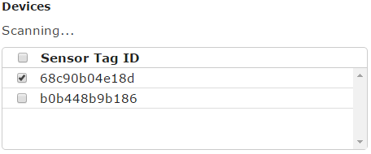
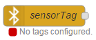
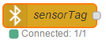

# node-red-contrib-sensortag
This [Node-RED](http://nodered.org/) node can be used connect to any number of Ti SensorTags and read the sensor data into Node-RED.

### Install

This node is available as a package on npm. To install run:
```
npm install node-red-contrib-sensortag
```

This node uses `noble` as the underlying library. To read about its prerequisites you can visit [its GitHub repository](https://github.com/sandeepmistry/noble#prerequisites).

### Configuration

This node can be configured to connect to any number of sensor tags. The device scanning process will start on its own along with Node-RED. The discovered devices (identified by their MAC address) will show up in the node's configuration window, where you can select any number of sensor tags to connect to.



If you deploy a sensor tag node with no devices selected, the node will be disabled and show up as show below.



Once you select one or more devices and deploy the flow, the node will immediately attempt to connect to the selected devices, and the node's status will change accordingly.



Due to the nature of the discovery process, nodes will only attempt to connect to their devices once all devices required by all nodes have been discovered.
If a device required by one of the nodes is not found, none of the nodes will connect, and the configuration panel for the node at fault will show you which device is missing.


Each node can specify a set of sensor read intervals for the devices the node will connect to. For the supported sensors, the intervals will be forced between 10 - 2550ms.
